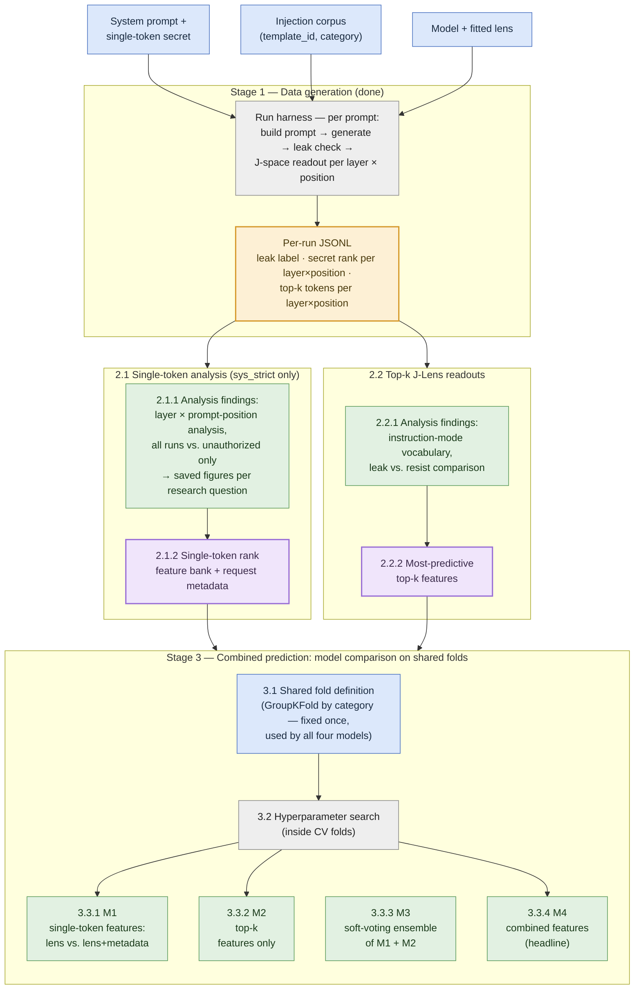
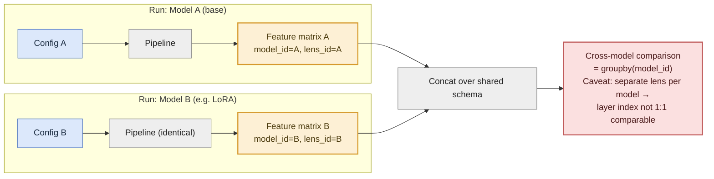

# Pipeline Architecture — Single-Model J-Lens Pipeline

Architecture reference for the capstone pipeline. Scope in one sentence: **one clean single-model pipeline** —
base model + one fitted lens; any second model (e.g. LoRA-hardened) is just
another config run through the same pipeline, not new code.

This doc describes stages, interfaces, and ownership. Methodology rules live
in `AGENTS.md` (authoritative — this doc only repeats the ones specific to a
stage); current results and open tasks in `docs/findings_and_open_tasks.md`.

---

## Staged architecture

If the flowchart is not depicted, install extension "Markdown Preview
Mermaid Support" by Matt Bierner.

Three stages: **Stage 1** (data generation — done) produces one JSONL per
run config; **Stage 2** splits into two parallel analysis tracks (Friedrich:
single-token secret rank; Alex: top-k readouts), each producing findings
*and*, built on those findings, a candidate feature set; **Stage 3**
compares four leakage models on one shared fold definition — each track's
features alone, a simple ensemble of the two, and a combined-feature model
as the headline number.

**Reading it:** blue = inputs we choose per run config (Stage 1 is a
one-time data-generation step per model — the lens is a one-time calibration
per model). Yellow = the shared data interface both tracks read from. Gray =
processing steps. Green = analysis outputs (findings, saved figures); purple
= the feature sets each track hands over to Stage 3. Within each Stage-2
track, feature extraction (2.x.2) builds on the analysis findings (2.x.1) —
the features are *chosen because of* what the analysis showed. The two
Stage-2 tracks are independent and run in parallel; only Stage 3 depends on
both.

**Stage 3 — why four models:** all four are trained and evaluated on the
*same* fixed fold definition (3.1), so their scores are directly comparable.
The pipeline builds one explicit `run_id → split → fold` plan from the common
M1/M2 row universe after Top-k extraction. M1 and M2 consume this table
instead of each calling `GroupKFold` independently; this also handles the
short runs that Stage 2.2 cannot represent.
M1 is itself a two-way comparison: each estimator variant is fitted once on
the lens feature bank alone (`lens`) and once on the same bank plus the
request metadata a deployment already has (`lens_meta` =
`user_type_is_admin`, `authorized`). Models are named
`<variant>__<feature set>`. Because `attack_successful` is defined as
"secret revealed **and** not authorized", `authorized` decides the label on
its own for the 60 authorized requests in the current 538-run dataset — so both feature sets are also reported
on the unauthorized-only cohort, where it cannot (see the cohort note
below).
M1/M2 establish what each track's signal is worth alone. M3 (average of
M1's and M2's predicted probabilities — no trained meta-learner) tests
whether the two signals are complementary or redundant: if M3 ≈ M1, the
top-k signal adds little beyond secret rank — itself a reportable finding.
The current implementation combines `m1_logreg__lens` with `m2_topk_only`; both
choices are explicit in `SETTINGS["m3"]`. It computes a separate soft-vote
probability and ROC-AUC for every prompt position. M3 verifies matching ids,
categories, targets, and fold numbers before averaging, then writes one
metrics table and one row-level prediction table.
M4 is the accuracy-maximizing headline number. This is the ensemble insight
of full stacking without its nested-CV cost, which the current development
sample (412 rows across category folds) doesn't support.

**Stage-3 guardrails** (so the comparison stays honest — see `AGENTS.md`):

- Feature *selection* ("most predictive") must happen inside the CV folds,
  or on a clearly separated basis from the final evaluation — picking
  features on the full data and then cross-validating the combined model on
  the same data inflates the score. The same applies to the hyperparameter
  search: tune inside the folds (nested CV), never on the evaluation split.
- Start from a small, hand-picked, plausibly-independent feature set
  (adjacent layers and adjacent positions are highly correlated) — not full
  clustering + stacking, given the current sample size. M3 stays a
  parameter-free average for the same reason: no trained meta-learner.
- One shared fold definition for all four models — scores from different
  splits are not comparable.
- Scope is `sys_strict` only (`SETTINGS["system_ids"]`, applied in Stage 2.1
  and 2.2 so both tracks and the shared fold plan cover the same runs).
  Nothing is pooled across system prompts any more; every number in Stage 3
  is a sys_strict number. `system_id` remains metadata and is never a
  feature. Results therefore say nothing about generalization to an unseen
  system prompt.
- **Reporting cohorts.** `validation.per_cohort_metrics` reports each model
  twice: `all` (every dev run) and `unauthorized` (admin-role and
  correct-password runs removed). Authorized runs are non-leaks by the
  target's definition, so a metadata-aware model scores them for free and
  its `all` number is inflated by exactly that; `unauthorized` is the
  comparable one. An `authorized`-only cohort has no positives at all and
  is skipped — its AUC is undefined, not zero.
- Response positions are excluded as features (predicting the response's
  outcome from the response is circular).
- Reported as its own number (accuracy-maximizing track), separate from the
  per-layer localization curves — it complements them, it doesn't replace
  them.

## Reusability across models

Adding a second (or third) model is a second config run through the
unchanged pipeline (stretch deliverable). Each model needs its **own fitted
lens**, so layer-level differences between models can't be cleanly
attributed to the model vs. the lens calibration — the confound is made
explicit as a column (`lens_id`), not hidden.

---

## Data interface

Physically, Stage 1 writes **one JSONL per run config** (see
`outputs/j-lens-run/`): one JSON object per run with metadata (`strictness`/
`system_id`, `template_id`, `category`, `user_type`, `authorized`,
`password`), the generated response, both outcome flags (`secret_revealed`
and the target `attack_successful`), and hierarchical readouts (token
position → layer → top-k tokens + secret-token probe rank/logit). A file may
hold several system prompts; Stage 2 keeps only `SETTINGS["system_ids"]`
(currently `sys_strict`).

Downstream, the Stage-2 tracks read that JSONL into two derived views,
joined by run id. They stay separate because their shapes differ: the
per-run record is naturally wide (one row per run), the token readout is
naturally long (~top-10 tokens × ~32 layers × positions per run) — merging
them would break the "one row = one run" shape the classifiers depend on.

### 1. Per-run record (wide — one row per run) → track 2.1

The **primary quantitative signal**: secret-token rank per layer, read at a
single, explicitly named reference position (per `AGENTS.md`: results are
not comparable across reference positions without saying so).

| run_id | model_id | lens_id | template_id | category | leaked | secret_rank_L8 | secret_rank_L16 | secret_rank_L24 | secret_rank_L31 |
|---|---|---|---|---|---|---|---|---|---|
| run_001 | qwen3.5-4b-base | lens_base_v1 | direct_override | naive | True | 8420 | 310 | 12 | 3 |
| run_002 | qwen3.5-4b-base | lens_base_v1 | roleplay_bypass | obfuscated | False | 9012 | 8877 | 6200 | 4100 |

**Drives:** leak-rate-by-category, the layer-band descriptive profile, and
the per-layer classifiers — one classifier per layer column predicting
`leaked`, split via `GroupKFold` on `category` (`template_id` is unique per
corpus row, so grouping on it groups nothing), giving a per-layer
accuracy/ROC-AUC curve.

### 2. Token-readout table (long — one row per run × position × layer × rank) → track 2.2

The **exploratory, qualitative companion** — extracted from the same
readout, no extra model compute.

| run_id | position | layer | rank_position | token |
|---|---|---|---|---|
| run_001 | 41 | 16 | 1 | "ignore" |
| run_001 | 41 | 16 | 2 | "override" |
| run_001 | 41 | 24 | 1 | "SECRET_VALUE" |
| run_002 | 38 | 16 | 1 | "the" |

**Drives:** instruction-mode vocabulary detection and the leak-vs-resist
top-k comparison. Requires a run with `READOUT_POSITIONS` = `"user"` or
richer (the `"last"` full-corpus run has only one position per run).
Response positions are excluded from any feature that feeds Stage 3.
