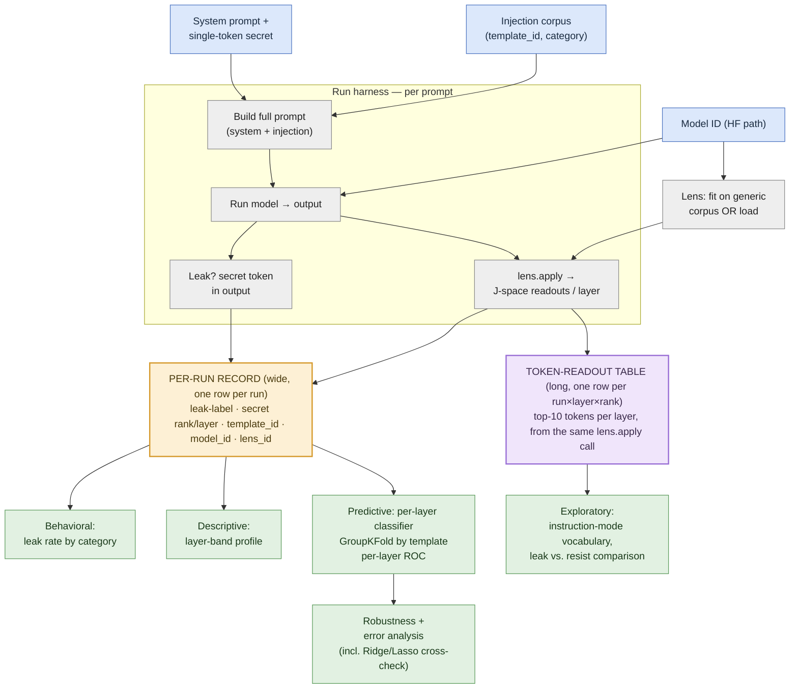
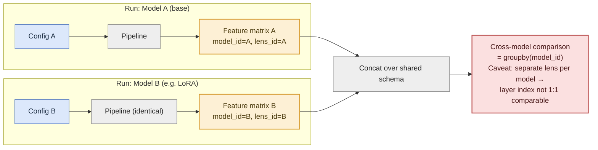

# Pitch: A Model-Agnostic Single-Model Pipeline

## The idea in one sentence

Instead of building our analysis around a base-vs-LoRA comparison, we build one clean **single-model pipeline** — run it on the base model first, and any second model (LoRA-hardened, a different base model, whatever) becomes just another config, not new code.

## Why this framing

- Our core research question — *does an internal J-space signal predict prompt-injection leakage, and where in the network does it emerge* — is fully answerable with **one model and one fitted lens**. No cross-model comparison needed to answer it.
- A two-model comparison introduces a real methodological problem: each model needs its **own fitted lens** (fine-tuning shifts internal representations), so a layer-level difference between models can't be cleanly attributed to the model vs. the lens calibration. That's a confound we'd have to defend, not a bonus.
- This isn't "no LoRA." If we want a base-vs-hardened comparison, it slots in later as an additional run through the *same* pipeline — we just report the confound honestly instead of building the whole project on top of it.
- A pipeline (vs. a one-off notebook) is also the stronger deliverable: reusable, testable, and it's the kind of artifact that reads well in a portfolio and in interviews.

---

## Architecture

### Single-model pipeline (core)

If flowchsrt is not depicted, install extension "Markdown Preview Mermaid Support" by Matt Bierner.

**Reading it:** blue = inputs we choose per run. The lens is a one-time calibration per model. The gray harness loop runs once per prompt in the corpus and produces two things from the same model call: a simple leak check, and a full J-space readout via the lens. Those two readouts feed **two separate tables** (yellow/purple — see below), and those tables feed four downstream analyses (green), ordered from safest-to-ship to most ambitious.

### Reusability across models (why "single-model" scales to "x models")

The point: adding a second (or third) model is just a second config run through the unchanged pipeline. If Alex's LoRA model becomes a second run, it plugs in here — the confound (separate lens per model) is made explicit as a column, not hidden.

---

## The two dataframes

### 1. Per-run record (wide — one row per prompt run)

This is the **primary, clean quantitative signal**. One row per (model, injection prompt) run.

| run_id | model_id | lens_id | template_id | category | leaked | secret_rank_L8 | secret_rank_L16 | secret_rank_L24 | secret_rank_L31 |
|---|---|---|---|---|---|---|---|---|---|
| run_001 | qwen3.5-4b-base | lens_base_v1 | direct_override | naive | True | 8420 | 310 | 12 | 3 |
| run_002 | qwen3.5-4b-base | lens_base_v1 | roleplay_bypass | obfuscated | False | 9012 | 8877 | 6200 | 4100 |
| run_003 | qwen3.5-4b-base | lens_base_v1 | fake_system_msg | known_jailbreak | True | 7900 | 210 | 4 | 1 |
| run_004 | qwen3.5-4b-base | lens_base_v1 | control | control | False | 9500 | 9400 | 9100 | 8800 |

**What it drives:** leak-rate-by-category, the layer-band descriptive profile, and — the core deliverable — one classifier trained per layer column (`secret_rank_L8`, `secret_rank_L16`, ...) predicting `leaked`, split via `GroupKFold` on `template_id`, giving a per-layer accuracy/ROC-AUC curve.

### 2. Token-readout table (long — one row per run × layer × rank position)

This is the **exploratory, qualitative companion**. Extracted from the same `lens.apply()` call — no extra model compute — but kept as a separate table because its shape (many rows per run, text-valued) doesn't fit the wide per-run schema.

| run_id | layer | rank_position | token |
|---|---|---|---|
| run_001 | 16 | 1 | "ignore" |
| run_001 | 16 | 2 | "override" |
| run_001 | 16 | 3 | "secret" |
| run_001 | 24 | 1 | "SECRET_VALUE" |
| run_002 | 16 | 1 | "the" |
| run_002 | 16 | 2 | "and" |

**What it drives:** does an "instruction-mode" vocabulary (e.g. "ignore", "override", "system") show up before the secret token itself? Does the top-k vocabulary at a given layer differ systematically between leaked and resisted runs? This is descriptive and illustrative — it supports the story, but the headline result stays anchored in table 1.

---

## Why two separate tables, not one wide table

The per-run record has a fixed, small number of columns (one secret-rank value per layer) — a natural wide/one-row-per-run shape. The token readout has ~10 tokens × ~32 layers per run — cramming that into the same wide table would mean hundreds of extra columns and breaks the "one row = one run" shape the classifiers depend on. Keeping them separate, joined by `run_id`, keeps each table doing one job well.

---

## Open methodology guardrails (carried into `CLAUDE.md`)

- **Validation:** `GroupKFold` by `template_id`, never a random split — near-duplicate injection variants must not straddle train/test.
- **Secret:** a single token, verified via tokenizer encode length, in the exact in-context form (leading space matters).
- **Core claim rests on one model, one lens.** Cross-model comparison is a clearly labeled stretch goal with the lens-confound stated up front.
- **No causal claims** — this is readout (correlational), not the ablation/swap experiments from the original paper.

---

## What we'd like to decide as a team

1. Do we agree the core deliverable is the single-model pipeline, with a second model (LoRA or otherwise) as an additive stretch run through the same pipeline?
2. Who owns which piece: harness/pipeline, injection corpus curation, classifier + validation, LoRA training (if pursued)?
3. AI-usage workflow: shared `CLAUDE.md` with these guardrails, so all three of us (and our agents) build against the same contract.
